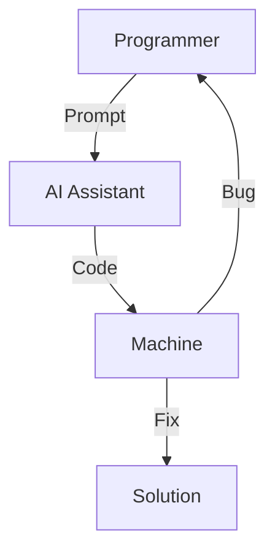
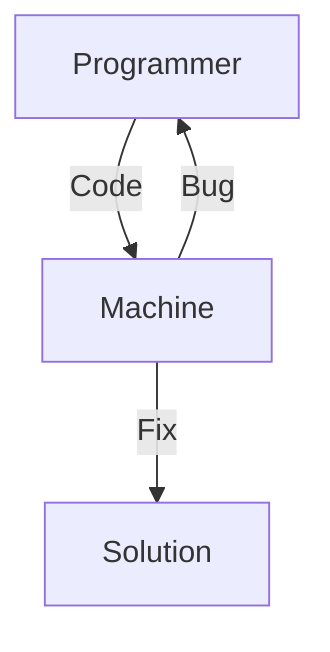

## Vim to Cursor

The creator of VIM, Bram Moolenaar, passed away on 3rd of August, 2023. In the
same year, Cursor, the popular AI IDE raised $20 million in Series A funding,
after it had been founded for one year.

## What do we gain and what do we lose?

### The gain is very observable

The evolution of programming paradigms has witnessed a significant shift from
the traditional approach of manual code writing to a more abstract, AI-assisted
method. In the past, programmers were required to meticulously type out every
line of code, carefully considering syntax, logic, and implementation details.
This process demanded a deep understanding of programming languages and
frameworks. However, the landscape is rapidly changing with the advent of
AI-powered coding assistants. Now, developers can often achieve the same results
by providing high-level prompts or natural language descriptions of their
intended functionality. These AI tools then generate the necessary code,
handling much of the low-level implementation details automatically. This
paradigm shift not only accelerates development speed but also lowers the
barrier to entry for programming, allowing individuals with less technical
expertise to create complex software solutions.

But is it all good?

### Emotional fulfillment as a programmer may not be there

One significant aspect that may be lost in the transition to AI-assisted coding
is the emotional fulfillment and psychological satisfaction that many
programmers derive from the traditional coding process. The act of manually
crafting code, line by line, can be deeply rewarding. It's a process that
engages the mind, challenges problem-solving skills, and provides a sense of
accomplishment when complex algorithms are successfully implemented. This
hands-on approach allows developers to feel a strong connection to their work,
fostering a sense of ownership and pride in the final product.


Moreover, the journey of coding manually often leads to serendipitous
discoveries and learning opportunities. As programmers navigate through the
intricacies of syntax and logic, they frequently encounter new concepts,
alternative approaches, or unexpected challenges. These experiences contribute
to a deeper understanding of the programming language and the problem domain,
leading to personal and professional growth. The AI-based approach, while
efficient, may bypass these valuable learning experiences, potentially limiting
the depth of knowledge acquired during the development process.

The debate extends to the question of whether AI-generated code can truly
replicate the nuanced understanding that comes from manual coding. When
programmers write code by hand, they are forced to consider every aspect of the
implementation, from data structures to algorithm efficiency. This detailed
involvement leads to a comprehensive grasp of the system's architecture and
behavior. In contrast, relying heavily on AI-generated code might result in a
more superficial understanding, where developers may struggle to explain or
modify the underlying mechanisms of their software.

To illustrate this point, consider the process of setting up a VIM-based
Integrated Development Environment (IDE). This task exemplifies the benefits of
hands-on, detailed work in programming. Configuring VIM as an IDE requires a
deep dive into the editor's functionality, plugin ecosystem, and customization
options. Programmers must carefully select and configure each component, from
syntax highlighting to code completion plugins. This process not only results in
a highly personalized and efficient development environment but also imparts
valuable knowledge about system configuration, scripting, and the interplay
between various development tools.

The VIM setup process encourages developers to think critically about their
workflow, identifying pain points and implementing solutions. It fosters a
mindset of continuous improvement and optimization, skills that are crucial in
software development. Furthermore, the intimate knowledge gained through this
setup process empowers developers to quickly troubleshoot issues and adapt their
environment as needs change. This level of control and understanding is often
lost when relying on pre-configured IDEs or AI-assisted coding platforms, where
the underlying mechanics remain opaque to the user.

The picture below shows the IDE experience with VIM and its plugin, called `nerdtree`. See reference  
[here](https://vimawesome.com/plugin/git-nerdtree) (it was created by
[@jistr](https://github.com/jistr) 10 years ago!).


To achieve the above, assuming the plugin of `nerdtree` is installed, you can use the following steps:

Place this in your .vimrc:

```vim
Plugin 'xuyuanp/git-nerdtree'
```

then run the following in Vim:

```vim
:source %
:PluginInstall
```
As is seen, it requires some manual work to setup the IDE within VIM. 

### No more need for in-depth understanding about the low-level details

While AI-based coding tools have revolutionized the programming landscape, they
also introduce a potential disconnect between programmers and the underlying
systems they work with. This abstraction, while beneficial for rapid
development, may lead to a superficial understanding of programming concepts and
system architecture.

One of the primary concerns is the potential loss of performance optimization
skills. Traditional programming practices often require developers to have a
deep understanding of memory management, CPU architecture, and algorithmic
efficiency. This knowledge allows them to write code that not only functions
correctly but also performs optimally. AI-generated code, while functional, may
not always be the most efficient solution, especially for complex or
resource-intensive applications.

Moreover, the abstraction provided by AI coding tools may hinder a programmer's
ability to debug effectively. When issues arise, especially those related to
performance or unexpected behavior, a solid grasp of low-level details becomes
crucial. Programmers who rely heavily on AI-generated code may find themselves
ill-equipped to diagnose and resolve such problems, potentially leading to
increased development time and suboptimal solutions.

Another consideration is the impact on innovation and advancement in computer
science. Many groundbreaking developments in programming languages, frameworks,
and systems have come from developers who deeply understood the intricacies of
computer architecture. By removing the need for this knowledge, we risk stifling
innovation in these fundamental areas, potentially slowing the overall progress
of computer science and software engineering.

Lastly, there's a concern about the long-term sustainability of software
development as a profession. As AI tools become more sophisticated, there's a
risk of creating a generation of programmers who are overly dependent on these
tools and lack the foundational knowledge to adapt to new technologies or solve
novel problems. This could lead to a widening gap between AI-assisted
programmers and those with deep technical expertise, potentially reshaping the
job market and the nature of software development roles.

### How do programmers talk to the AI tools with responsibility and accountability?

I have to say, the debugging experience for AI-generated code is not there yet.
Particularly, I am working in the data science domain, where domain knowledge
plays a crucial role. Relying on AI tools to generate code without fully
understanding the underlying mechanisms can be challenging. The current practice
of programming with AI assistants is done in a black-box manner, where the
programmer inputs a prompt and the AI tool generates code. 

AI-based approach:


Conventional approach:


The debugging process for the AI-based approach and the conventional approach
are different. In the AI-based approach, the programmer is not directly involved
in the debugging process. The AI assistant is the one that fixes the bug. In the
conventional approach, the programmer is the one that fixes the bug. So the bug
may arise in multiple places, and it is not clear which part of the code is
causing the bug. It is worth noting that the impact of such difference is even
higher in the code development for data science applications, reason being that
the codes involve facts that may not be known to the AI assistant but known to
the programmer/domain expert.